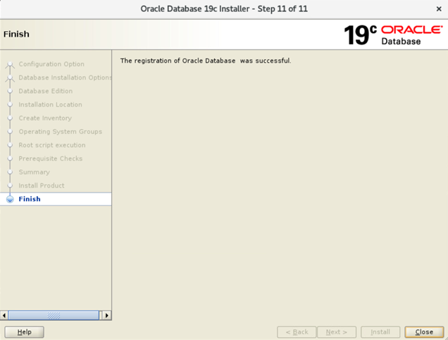
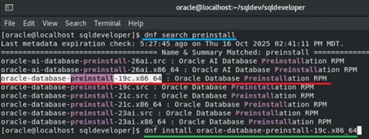
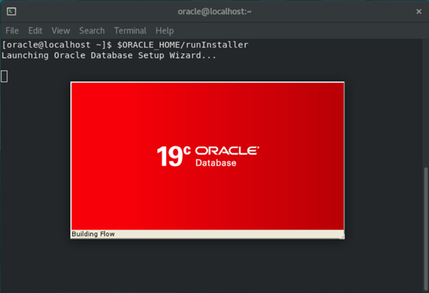
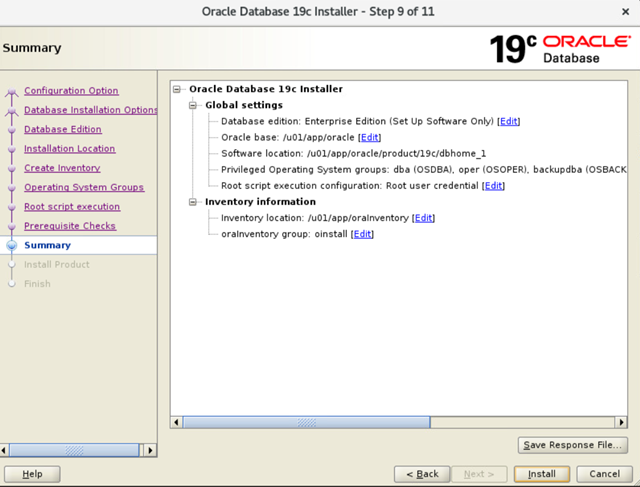
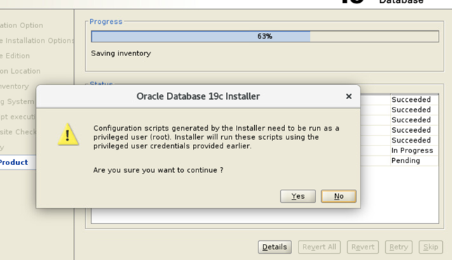
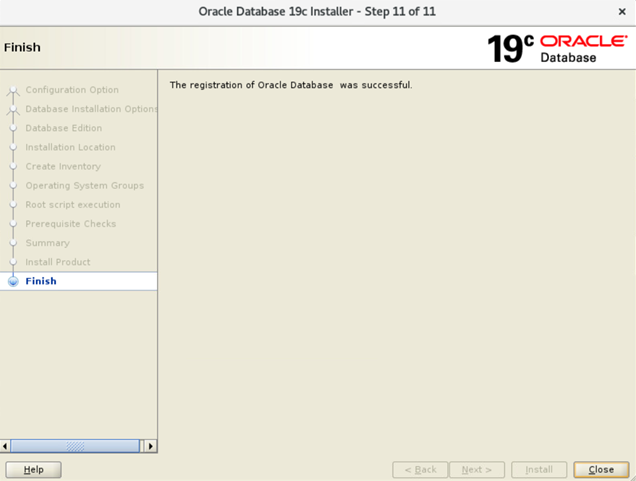

# Práctica 1.1. Instalación del software de la base de datos Oracle 19c


<br/><br/>

## Objetivos
Al finalizar la práctica, serás capaz de:

* Verificar que el sistema operativo cuente con los prerrequisitos necesarios para la instalación de Oracle 19c.
* Ejecutar el paquete de preinstalación de Oracle para configurar usuarios, grupos y parámetros del sistema.
* Instalar los binarios del software de la base de datos Oracle 19c bajo el usuario `oracle`.
* Configurar correctamente las variables de entorno requeridas (`ORACLE_BASE`, `ORACLE_HOME`, `PATH`).
* Ejecutar el instalador gráfico (`runInstaller`) utilizando la opción **Set Up Software Only**.
* Completar la instalación del software de base de datos preparando el entorno para la creación posterior de una base de datos multi-tenant.

<br/><br/>

## Tiempo estimado
- 120 minutos.

<br/><br/>

## Objetivo visual 

La imagen muestra la pantalla final del asistente de instalación de Oracle Database 19c, donde se confirma que la instalación y el registro del software se completaron exitosamente.



<br/><br/>

## Archivos ZIP

Durante esta práctica, debes asegurarte de contar con los siguientes archivos ZIP o instaladores descargados en el directorio `Downloads` del usuario `oracle`:

| Nº | Archivo / Software                                                | Descripción                                                                                | Enlace oficial de descarga                                                                                                                                 |
| -- | ----------------------------------------------------------------- | ------------------------------------------------------------------------------------------ | ---------------------------------------------------------------------------------------------------------------------------------------------------------- |
| 1  | **LINUX.X64_193000_db_home.zip**                                  | Instalador principal de **Oracle Database 19c** para Linux (binarios de la base de datos). | [https://www.oracle.com/database/technologies/oracle19c-linux-downloads.html](https://www.oracle.com/database/technologies/oracle19c-linux-downloads.html) |
| 2  | **LINUX.X64_193000_grid_home.zip** *(opcional)*                   | Software de **Oracle Grid Infrastructure** necesario si se planea usar ASM o RAC.          | [https://www.oracle.com/database/technologies/oracle19c-linux-downloads.html](https://www.oracle.com/database/technologies/oracle19c-linux-downloads.html) |
| 3  | **oracle19c-examples.zip** *(opcional)*                           | Esquemas y ejemplos de base de datos (HR, OE, SH, etc.) para pruebas y desarrollo.         | Incluido en la sección *Sample Schemas* del mismo sitio.                                                                                                   |
| 4  | **sqldeveloper-<versión>-no-jre.zip**                              | Herramienta gráfica **SQL Developer** para administración y desarrollo en Oracle.          | [https://www.oracle.com/database/sqldeveloper/technologies/download/](https://www.oracle.com/database/sqldeveloper/technologies/download/)                 |
| 5  | **jdk-17.0.12_linux-x64_bin.rpm** *(requerido por SQL Developer)* | Instalador de **Java 17**, necesario para ejecutar SQL Developer.                          | [https://download.oracle.com/java/17/archive/](https://download.oracle.com/java/17/archive/)                                                               |


<br/><br/>

## Instrucciones 

<br/>

#### **Paso 1.** Verifica que todos los productos de software necesarios para instalar Oracle 19c estén descargados en el directorio `Downloads`.
   ```
   ls Downloads

   # crea y cambiate al directorio scripts
   mkdir scripts
   cd scripts

   # Crea el archivo setEnv.sh con el siguiente contenido
   vi setEnv.sh
   mkdir -p /u01/app/oracle/product/19c/dbhome_1
   chown -R oracle:oinstall /u01
   chmod -R 775 /u01
   :wq!
   ```
<br/>

#### **Paso 2.** Desde la cuenta `root`, ejecuta el comando:

   ```
   su 
   Password: Oracle1
   dnf search preinstall
   dnf install oracle-database-preinstall-19c.x86_64

   # Cambiate al directorio scripts y ejecuta el shell setEnv.sh
   cd /home/oracle/scripts
   sh setEnv.sh
   exit
   ```
<br/>

#### **Paso 3.** Como usuario `oracle`, descomprime el archivo ZIP del software de base de datos (por ejemplo `LINUX.X64_193000_db_home.zip`) en la ubicación del DB Home.

   ```
   cd Downloads
   unzip LINUX.X64_193000_db_home.zip -d /u01/app/oracle/product/19c/dbhome_1
   ```
<br/>

#### **Paso 4.** Verifica las variables de entorno.

   ```
   $ env | grep ORA
   ```

<br/>

#### **Variables de entorno**

| Variable      | Valor                                  |
| ------------- | -------------------------------------- |
| `ORACLE_BASE` | `/u01/app/oracle`                      |
| `ORACLE_HOME` | `/u01/app/oracle/product/19c/dbhome_1` |
| `PATH`        | `$PATH:$ORACLE_HOME/bin`               |

<br/>

#### **Paso 5.** Ejecuta el instalador del software, con el usuario `oracle`:

   ```
   $ORACLE_HOME/runInstaller
   ```
<br/>

#### **Paso 6.** Sigue al asistente, seleccionando las siguientes opciones:

6.1. **Configuration Option.** Selecciona `Set Up Software Only` para instalar únicamente los binarios del software, sin crear todavía una base de datos.

6.2. **Database Installation Option.** Elige `Single Instance Database Installation` para una instalación estándar de una sola instancia.

6.3. **Database Edition.** Selecciona `Standard Edition 2 (SE2)` o `Enterprise Edition (EE)`, según la licencia disponible. Para fines del curso, elige `Enterprise Edition`.

6.4. **Installation Location.** Verifica que las rutas de instalación sean correctas:

   * **Oracle Base:** `/u01/app/oracle`
   * **Oracle Home:** `/u01/app/oracle/product/19c/dbhome_1`

6.5. **Create Inventory.** Confirma la ruta del archivo de inventario, generalmente:

   * **Inventory Directory:** `/u01/app/oraInventory`
   * **Group Name:** `oinstall`

6.6. **Privileged Operating System Groups.** Mantén los grupos predeterminados que el instalador muestra por defecto.

6.7. **Root Scripts.** Marca la opción `Automatically run configuration scripts`. Cuando se solicite, introduce la contraseña del usuario `root` para que el instalador ejecute los scripts necesarios.

6.8. **Prerequisite Checks.** Si aparecen advertencias menores (*warnings*), selecciona `Ignore All` y confirma con `Yes` para continuar.

6.9. **Summary.** Revisa el resumen final de las configuraciones seleccionadas antes de iniciar la instalación.

6.10. **Install Product.** Guarda el archivo de respuestas en el directorio predeterminado y haz clic en `Install` para comenzar la instalación del software.

<br/><br/>


## Resultado esperado

* La captura siguiente muestra el flujo típico para preparar el entorno de instalación de Oracle 19c en Linux usando DNF.

* Ejecutar el paquete de preinstalación es la forma más rápida y confiable de establecer el entorno operativo básico que permite que el `runInstaller` (el instalador gráfico de Oracle) se ejecute sin fallar por requisitos de hardware o software faltantes.




<br/><br/>

* La siguiente imagen presenta la ejecución del comando `$ORACLE_HOME/runInstaller` en una terminal Linux bajo el usuario oracle. Este comando inicia el __Asistente de Instalación de Oracle Database 19c__, una interfaz gráfica que guía paso a paso el proceso de instalación del software de base de datos.




<br/><br/>


* La imagen siguiente muestra la pantalla `Summary` del instalador gráfico de **Oracle Database 19c**, correspondiente al **paso 9 de 11** del asistente.




<br/><br/>


* Puedes ver en la siguiente imagen una ventana del instalador de Oracle Database 19c que aparece durante el proceso de instalación, indicando que los scripts de configuración generados deben ejecutarse con privilegios de superusuario (`root`).



<br/><br/>

* A continuación, se ilustra la pantalla final del instalador de Oracle Database 19c, correspondiente al paso 11 de 11 del asistente. En ella, se indica que la instalación y el registro de Oracle Database se completaron correctamente mediante el mensaje `The registration of Oracle Database was successful`.

* Este paso confirma que todos los componentes del software se instalaron sin errores y que la base de datos fue registrada en el inventario del sistema. El proceso concluye al presionar el botón `Close`, finalizando así la instalación del software de base de datos Oracle 19c.



