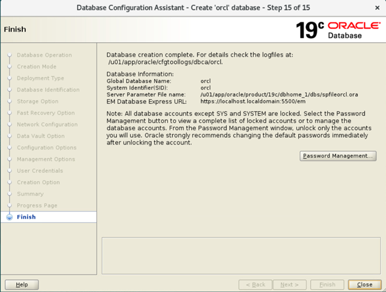
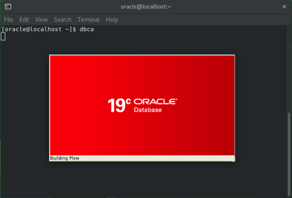
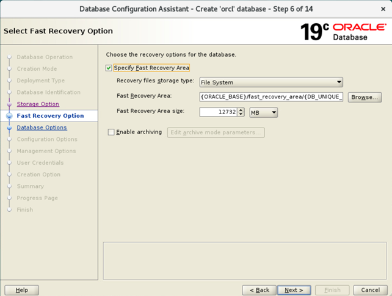
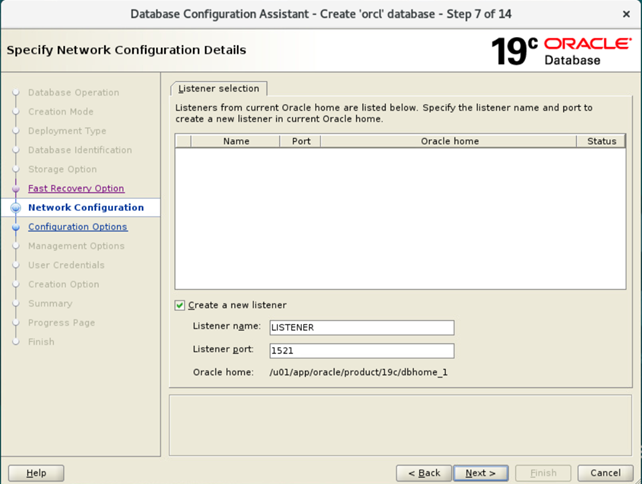
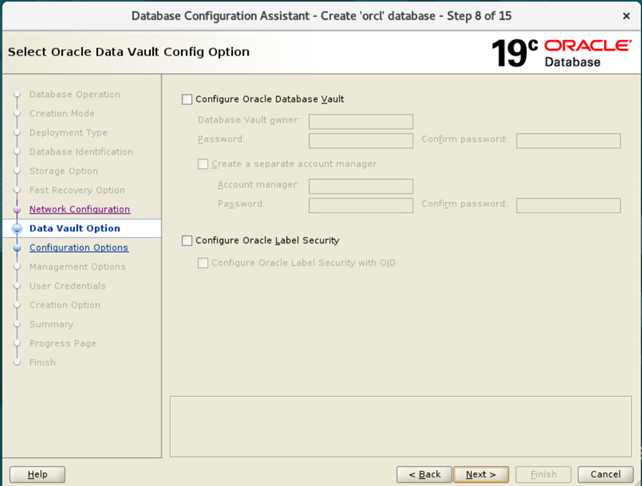
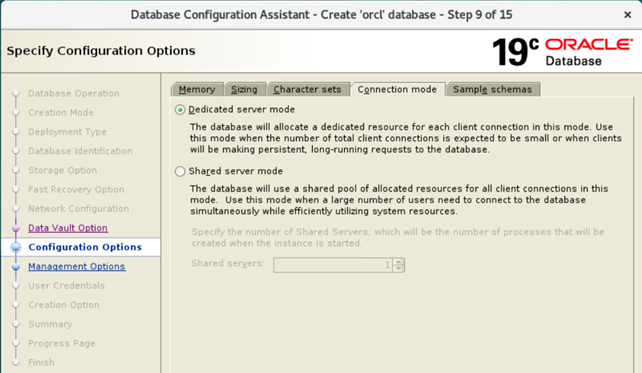
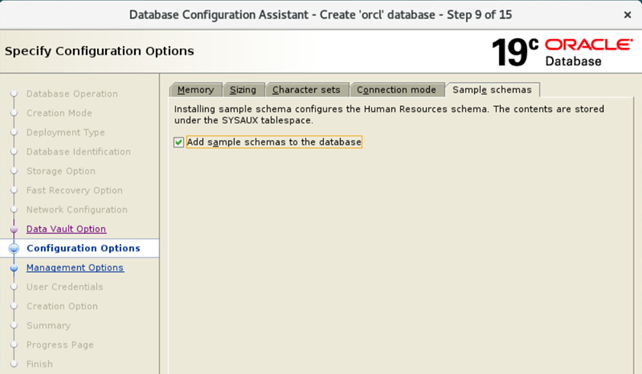
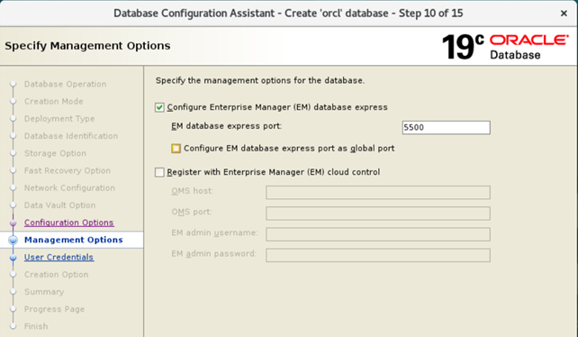
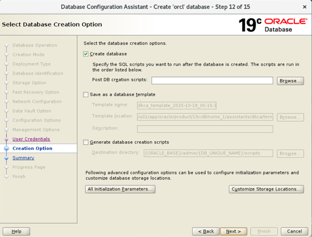
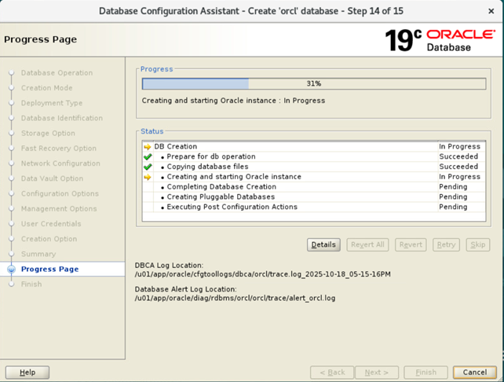

# Práctica 1.2. Creación de una base de datos multi-tenant (con DBCA)

<br/><br/>

## Objetivos
Al finalizar la práctica, serás capaz de:
* Ejecutar el asistente de configuración de base de datos **(Database Configuration Assistant, DBCA)** para crear una base de datos multi-tenant en Oracle 19c.
* Configurar los parámetros principales de la base de datos, como el nombre global, el SID y la PDB.
* Definir el tipo de almacenamiento, el área de recuperación rápida (FRA) y las opciones de red.
* Asignar contraseñas administrativas y habilitar herramientas de gestión como **Enterprise Manager Database Express**.
* Validar la correcta creación y registro de la **CDB (Container Database)** y la **PDB (Pluggable Database)**.

<br/><br/>

## Tiempo estimado
- 120 minutos.

<br/><br/>

## Objetivo visual 

La siguiente captura de pantalla muestra el final del Database Configuration Assistant (DBCA), donde se confirma que la creación de la base de datos Oracle 19c fue completada exitosamente.



<br/><br/>

## Tabla de ayuda
 
### Variables configuradas por el DBCA

| **Nombre de la variable** | **Valor en el ejemplo**                | **Explicación**                                                                                 |
| ------------------------- | -------------------------------------- | ----------------------------------------------------------------------------------------------- |
| `ORACLE_BASE_HOME`        | `/u01/app/oracle/product/19c/dbhome_1` | Es el directorio donde se instaló el software de la base de datos Oracle (el Oracle Home).      |
| `DB_UNIQUE_NAME`          | `orcl`                                 | Nombre único global asignado a la base de datos; se utiliza para definir las rutas de archivos. |
| `ORACLE_BASE`             | `/u01/app/oracle`                      | Directorio base de la instalación de Oracle; raíz de la estructura de directorios.              |
| `PDB_NAME`                | `pdb1`                                 | Nombre de la base de datos conectable (Pluggable Database) configurada.                         |
| `DB_NAME`                 | `orcl`                                 | Nombre principal de la base de datos.                                                           |
| `ORACLE_HOME`             | `/u01/app/oracle/product/19c/dbhome_1` | Sinónimo de `ORACLE_BASE_HOME`.                                                                 |
| `SID`                     | `orcl`                                 | Identificador único de la instancia de Oracle en el sistema operativo.                           |

<br/><br/>


## Instrucciones

#### **Paso 1.** Ejecuta el DBCA como usuario `oracle`.

   ```bash
   # Verifica que la variable CV_ASSUME_DISTID=OEL7 exista en el ambiente del shell.
   env|grep CV

   # Si la variable no existe, edita el archivo .bashrc y agrega la siguiente linea al final
   vi .bashrc
   export CV_ASSUME_DISTID=OEL7

   # Vuelve a ejecutar el archivo .bashrc
   . ./.bashrc

   # Invoca la utileria database configuration assistant
   $ dbca
   ```
<br/>

#### **Paso 2.** Configura las opciones iniciales.

  
* `Creation Mode`: selecciona `Create a database` para iniciar la creación de una nueva base de datos.
* `Creation Type`: elige `Advanced Configuration` para personalizar los parámetros de instalación.
* `Database Type`: selecciona `Oracle Single Instance Database` y asegúrate de marcar la opción `Create as Container Database (CDB)`.

<br/>

#### **Paso 3.** Define los nombres principales.

   * `Global Database Name`: `pdb.localhost.localdomain` (usa la opcion default que aparezca).
   * `Pluggable Database Name`: `pdb` (puede ajustarse según necesidad).
   * `SID`: igual al nombre de la base de datos (por ejemplo, `orcl`).

<br/>

#### **Paso 4.** Configura el tipo de base de datos y la plantilla.

   * `Database type`: `Oracle Single Instance database`.
   * `Template name`: `General Purpose or Transaction Processing`.

<br/>

#### **Paso 5.** Define las opciones de almacenamiento.

   * `Storage type`: `File System`.
   * `Database files location`: `{ORACLE_BASE}/oradata/{DB_UNIQUE_NAME}`.
   * Activa `Use Oracle Managed Files (OMF)` para una gestión automática de archivos (no elegir por el momento).

<br/>

#### **Paso 6.** Configura el área de recuperación rápida (FRA).

   * Marca `Specify Fast Recovery Area`.
   * Ruta: `{ORACLE_BASE}/fast_recovery_area/{DB_UNIQUE_NAME}`.
   * Asigna un tamaño suficiente (por ejemplo, 14 GB).
   * Puedes dejar desmarcada la opción `Enable Archiving` si se trata de un entorno de práctica.


<br/>

#### **Paso 7.** Configura el listener de red.

   * `Listener name`: `LISTENER`.
   * `Port`: `1521`.
   * Deja seleccionada la opción `Create a new listener`.

<br/>

#### **Paso 8.** Desactiva las opciones avanzadas de seguridad.

   * Deja sin marcar `Database Vault` y `Label Security`.

<br/>

#### **Paso 9.** Ajusta la configuración de instancia (Configuration Options).

   * `Memory`: usa `Automatic Shared Memory Management`. (Dejar los valores que muestre por default).
   * `Sizing`: usa `Processes 320`.
   * `Character set`: `AL32UTF8`.
   * `Connection mode`: `Dedicated server mode`.
   * Marca `Add sample schemas to the database`.

<br/>

#### **Paso 10.** Configura las herramientas de gestión.
   * Marca `Configure Enterprise Manager (EM) Database Express`.
   * `Port`: `5500`.

<br/>

#### **Paso 11.** Define las contraseñas administrativas.

   * Selecciona `Use the same administrative password for all accounts`.
   * Asigna una contraseña y confírmala (por ejemplo, `oracle_4U`).

<br/>

#### **Paso 12.** Finaliza la creación.

   * Selecciona `Create database` y haz clic en `Next`.
   * Revisa el resumen de configuración.
   * Haz clic en `Finish` para iniciar la creación de la base de datos.

<br/>

#### **Paso 13.** Supervisa el progreso.

   * Espera hasta que todas las tareas del asistente se marquen como `Succeeded`.
   * Al finalizar, aparecerá el mensaje `The registration of Oracle Database was successful.`
   * Cierra el asistente con `Close`.


<br/>
<br/>


## Resultado esperado

**Ejecución del DBCA**
La siguiente imagen muestra la ejecución del comando `dbca` desde la terminal bajo el usuario `oracle`. Este comando inicia el `Database Configuration Assistant`, la herramienta gráfica que permite crear y configurar bases de datos Oracle.



<br/>
<br/>

**Fast Recovery Area, FRA**
La siguiente imagen muestra la sección `Fast Recovery Option` del DBCA durante la creación de la base de datos. En este paso se define el área de recuperación rápida (Fast Recovery Area, FRA), donde Oracle almacenará archivos esenciales para la recuperación, como respaldos, archived redo logs y flashback logs.
El resultado esperado es que el usuario seleccione la opción `Specify Fast Recovery Area`, mantenga el tipo de almacenamiento como File System y establezca una ruta predeterminada —por ejemplo, `{ORACLE_BASE}/fast_recovery_area/{DB_UNIQUE_NAME}`— junto con un tamaño suficiente (en este caso, 12732 MB).



<br/>
<br/>

**Configuración de red (Listener)**

En esta pantalla se define el `Listener`, el proceso que permite las conexiones de red hacia la base de datos. Se crea un nuevo listener llamado `LISTENER`, con puerto `1521` y asociado al Oracle Home actual.



<br/>
<br/>

**Opciones de seguridad avanzadas (Database Vault y Label Security)**

El asistente ofrece la opción de habilitar `Oracle Database Vault` y `Oracle Label Security`, mecanismos de seguridad avanzada. En entornos de práctica se recomienda dejar ambas opciones desmarcadas.



<br/>
<br/>

**Configuración del modo de conexión (Dedicated / Shared)**

Aquí, se selecciona el modo de conexión de los clientes: elige el modo `Dedicated server mode`, en el cual cada conexión de usuario tiene un proceso dedicado, ideal para entornos de desarrollo.



<br/>
<br/>

**Instalación de esquemas de ejemplo**

Esta pantalla permite añadir los **esquemas de ejemplo** (como HR) para fines de aprendizaje y pruebas. Debe marcarse la opción `Add sample schemas to the database`.



<br/>
<br/>

**Opciones de gestión (Enterprise Manager Express)**

Se configura la herramienta de administración `Enterprise Manager Database Express`, activando el puerto `5500`, que permite acceder a la interfaz web de gestión de la base de datos.



<br/>
<br/>

**Selección de opciones de creación**

Aquí se confirma la opción *Create database* para generar la base de datos inmediatamente con las configuraciones establecidas. También es posible guardar la plantilla o generar scripts de creación.


**Monitoreo del progreso de creación**

Durante el proceso de creación, el asistente muestra el avance de las tareas: copia de archivos, inicio de la instancia y creación de la PDB.



**Finalización del asistente**

La última pantalla indica que la base de datos se creó correctamente. Muestra el nombre global (`orcl`), el SID y la URL de acceso a `Enterprise Manager Express`. Se finaliza presionando `Close`.


