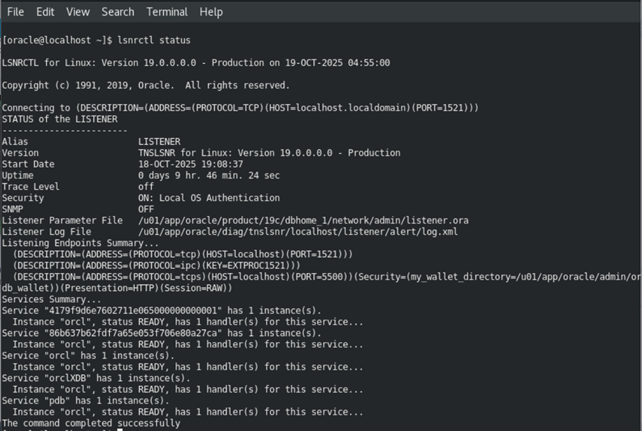
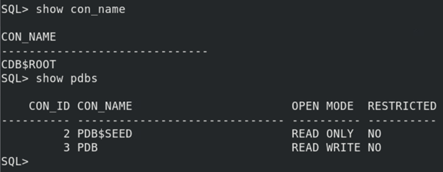

# Práctica 1.3. Configuración de conectividad y servicios

<br/><br/>

## Objetivo
Al finalizar la práctica, serás capaz de:
- Asegurar que la instancia, el Listener y las bases de datos sean accesibles.

<br/><br/>

## Objetivo visual 



<br/><br/>

## Tiempo estimado
- 120 minutos.

<br/><br/>

## Instrucciones 

### Tarea 1.  Verificar el estado del Listener

#### **Paso 1.** Inicia sesión como usuario `oracle` (en el Listener Home correspondiente).

#### **Paso 2.** Ejecuta el siguiente comando para verificar el estado del Listener.

   ```bash
   $ lsnrctl status
   ```

#### **Paso 3.** Verifica:

   * El Listener debe estar en ejecución (activo en el puerto **1521** por defecto).
   * Debe listar al menos dos servicios:

     * `orcl` → correspondiente a la **CDB**.
     * `pdb` → correspondiente a la **PDB**.

<br/><br/>

### Tarea 2. Conexión administrativa a la CDB

#### **Paso 1.** Conéctate al contenedor principal (**CDB**) como administrador.

   ```bash
   $ sqlplus / as sysdba
   ```

#### **Paso 2.** Verifica la conexión ejecutando los siguientes comandos dentro de SQLPlus.

   ```sql
   SHOW CON_NAME;
   -- Debe mostrar: CDB$ROOT

   SHOW PDBS;
   -- Debe listar la PDB existente
   ```

<br/><br/>

### Tarea 3. Conexión a la PDB

#### **Paso 1.** Conéctate directamente a la **PDB** utilizando el usuario `SYS`.

   ```bash
   $ sqlplus sys/oracle_4U@localhost/pdb as sysdba
   ```

#### **Paso 2.** Verifica el contenedor activo:

   ```sql
   SHOW CON_NAME;
   -- Debe mostrar el nombre de la PDB
   ```

#### **Paso 3.** También puedes conectarte como usuario `SYSTEM`:

   ```bash
   $ sqlplus system/oracle_4U@localhost/pdb
   ```
   
#### **Paso 4.** Dentro de SQLPlus, verifica nuevamente.

   ```sql
   SHOW CON_NAME;
   -- Debe mostrar la PDB
   ```

<br/><br/>

## Resultado esperado

**Verificación del Listener activo**
La imagen muestra la salida del comando `lsnrctl status`, utilizada para comprobar que el `Listener` de Oracle está activo. Se observa el servicio escuchando en el puerto `1521`, con los servicios `orcl` (CDB) y `pdb` (PDB) registrados y en estado `READY`, lo que confirma que las conexiones a la base de datos están disponibles.


<br/> <br/>

**Conexión a la CDB y verificación de PDB**
La imagen presenta los resultados de los comandos `SHOW CON_NAME` y `SHOW PDBS` ejecutados desde **SQLPlus**. Se confirma que el contenedor actual es `CDB$ROOT` y que existen dos bases de datos conectables: `PDB$SEED` (solo lectura) y `PDB` (modo lectura-escritura), validando la estructura multi-tenant correctamente creada.


