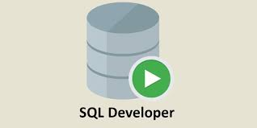
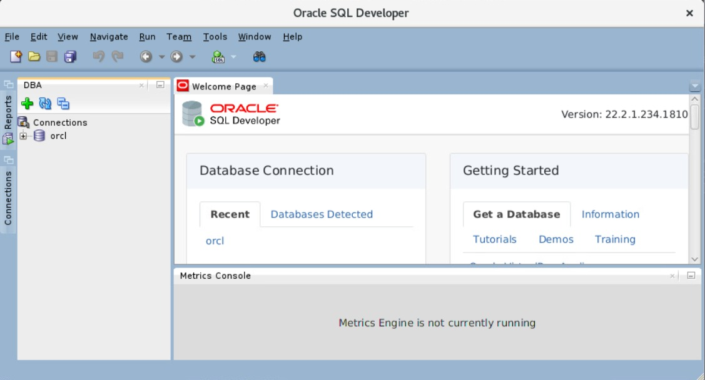

# Prática 1.4. SQL-Developer (opcional)

<br/><br/>

## Objetivos
Al finalizar la práctica, serás capaz de:
- Verificar que SQL Developer se encuentre instalado.
- Instalar SQL Developer en caso de que no se encuentre instalado.

<br/><br/>

## Tiempo estimado
- 120 minutos.

<br/><br/>

## Objetivo visual 




<br/><br/>

## Tabla de ayuda

### **Descarga de SQL Developer**

| **Software**             | **Descripción**                                                                | **Enlace de descarga**                                                                        |
| ------------------------ | ------------------------------------------------------------------------------ | --------------------------------------------------------------------------------------------- |
| **Oracle SQL Developer** | Herramienta gráfica para desarrollo y administración de bases de datos Oracle. | [Descargar desde Oracle](https://www.oracle.com/database/sqldeveloper/technologies/download/) |

<br/><br/>

## Instrucciones 

#### **Paso 1.** Asegúrate de tener instalado un **JDK**. Si no lo tienes, descárgalo (SQL Developer soporta **Oracle JDK 17**).

#### **Paso 2.** Instala el paquete ejecutando el comando:

   ```bash
   rpm -Uhv sqldeveloper-(build number)-1.noarch.rpm
   ```

#### **Paso 3.** Accede al directorio de instalación.

   ```bash
   cd sqldeveloper
   ```

#### **Paso 4.** Ejecuta el script de inicio.

   ```bash
   ./sqldeveloper.sh
   ```

#### **Paso 5.** Cuando se te solicite, introduce la ruta del `JDK`, por ejemplo:

   ```bash
   /usr/java/jdk-17
   ```

#### **Paso 6.** SQL Developer se iniciará automáticamente una vez que se proporcione la ubicación del JDK.

<br/><br/>


## Resultado esperado

La imagen representa el entorno inicial de Oracle SQL Developer (versión 22.2.1.234.1810) con una conexión disponible a la base de datos Oracle, lista para ejecutar consultas o administrar objetos de la base de datos.


