# Práctica 2.1. Upgrade de una base de datos Oracle 12c a la versión 19c

<br/><br/>

## Objetivo

Al finalizar la práctica, serás capaz de:

- Preparar un entorno Oracle 12c para su actualización, ejecutar el proceso de Upgrade de Oracle 12c a Oracle 19c, aplicar procedimientos de respaldo y recuperación, realizar tareas Post-Upgrade y validar la migración exitosa.

<br/><br/>

## Tiempo estimado
- 60 minutos.

## Objetivo visual 

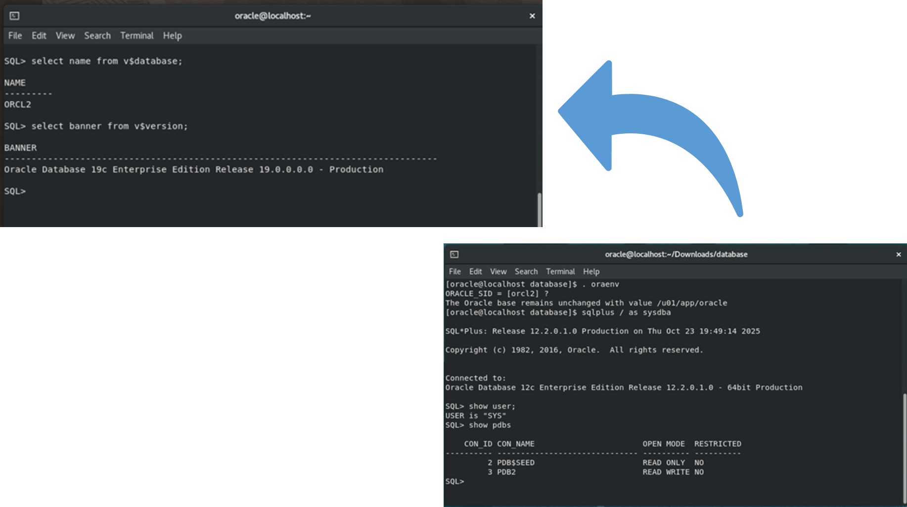

<br/><br/>

## Instrucciones 

### Tarea 1. Verificación o instalación de la base de datos Oracle 12c

#### **Paso 1.** Verificación de prerrequisitos.

1. Verifica si la base de datos **Oracle 12c** ya se encuentra instalada en el sistema.

   * Confirma que la **instancia de base de datos** con el nombre **`orcl2`** esté creada y disponible.

   ```bash
    . oraenv
    cat /etc/oratab
   ```

   * En caso afirmativo, pasa directamente a la **Tarea 2**.
   * Si no está instalada, continúa con los pasos siguientes.


#### **Paso 2.** Instalación del software Oracle 12c.

1. **Cambiar al usuario `oracle`** y descomprimir el archivo de instalación:

   ```bash
   cd ~/Downloads
   unzip V839960-01.zip
   ```

   Esto creará el directorio **database** con todo el software de Oracle 12c.

2. ** Como usuario root, crea los directorios necesarios** para la instalación y otorga permisos:

   ```bash
   su -
   password: Oracle1

   mkdir -p /u01/app/oracle/product/12c/dbhome_2
   chown -R oracle:oinstall /u01
   chmod -R 775 /u01
   exit
   ```

3. **Como usuario oracle, configurar las variables de ambiente** para Oracle 12c:

   ```bash
   cd /home/oracle/scripts
   cp setEnv.sh setEnv2.sh
   vi setEnv2.sh
   ```

   * Edita el archivo y actualiza las variables con los valores indicados en la tabla de referencia.
   * Guarda los cambios y cierra el editor.


| **Variable**      | **Valor**                            |
| ----------------- | ------------------------------------ |
| `ORACLE_UNQNAME`  | orcl2                                |
| `ORACLE_SID`      | orcl2                                |
| `ORACLE_BASE`     | /u01/app/oracle                      |
| `ORACLE_HOME`     | /u01/app/oracle/product/12c/dbhome_2 |
| `ORACLE_HOSTNAME` | localhost.localdomain                |

4. **Ejecutar el instalador de Oracle 12c**:

   ```bash
   
   cd /home/oracle/Downloads/database
   ./runInstaller
   ```

   * Sigue las instrucciones gráficas del instalador.
   * Configura los valores según las pantallas mostradas en las imágenes del laboratorio.

5. **Verificar la instalación:**

   * Comprueba que la base de datos Oracle 12c esté activa.
   * Accede a la cuenta de administración de Oracle:
```bash
sqlplus / as sysdba
```
   * Verifica que las *Pluggable Databases (PDBs)* estén presentes y en ejecución.
```bash
show user;
    show pdbs
```

<br/><br/>

### Tarea 2. Realizar el Upgrade de Oracle 12c a Oracle 19c

> **Ubicaciones de instalación:**
>
> * Oracle 12c: `/u01/app/oracle/product/12c/dbhome_2`
> * Oracle 19c: `/u01/app/oracle/product/19c/dbhome_1`

El proceso moverá la base de datos del antiguo *Oracle Home* (12c) al nuevo *Oracle Home* (19c).


#### **Paso 1.** Fase de preparación (Base 12c).

1. **Configurar el entorno de 12c:**

   ```bash
   source /home/oracle/scripts/setEnv2.sh
   ```

2. **Ejecutar la verificación previa (Pre-Upgrade):**

   ```bash
   cd /u01/app/oracle/product/19c/dbhome_1/rdbms/admin
   java -jar preupgrade.jar TERMINAL
   ```

   * Analiza los reportes generados:

     * `preupgrade.log`
     * `preupgrade_fixups.sql`

3. **Ejecutar correcciones (Fixups):**

   ```bash
   sqlplus / as sysdba
   SQL> @?/rdbms/admin/preupgrade_fixups.sql
   ```

   ```sqlplus
   @?/rdbms/admin/preupgrade_fixups.sql
   ```

4. **Crear un punto de restauración garantizado (GRP):**

   ```sqlplus
   SHUTDOWN IMMEDIATE;
   STARTUP MOUNT;
   ALTER DATABASE ARCHIVELOG;
   ALTER DATABASE FLASHBACK ON;
   ALTER DATABASE OPEN;
   CREATE RESTORE POINT PRE_UPGRADE GUARANTEE FLASHBACK DATABASE;
   SHUTDOWN IMMEDIATE;
   ```

   Deja la base de datos 12c **apagada** al finalizar.


<br/>

#### **Paso 2.** Fase de Upgrade (Base 19c).

1. **Configurar el entorno para 19c:**

   ```bash
   source /home/oracle/scripts/setEnv19c.sh
   ```

2. **Ejecutar el Database Upgrade Assistant (DBUA):**

   ```bash
   dbua
   ```

   * DBUA detectará automáticamente la BD 12c apagada.

   * Selecciona la instancia 12c y confirma el *Oracle Home 19c* como destino.

   * Inicia el proceso y espera a que concluya.

   > *Alternativamente, puedes usar la herramienta `AutoUpgrade` para hacerlo desde línea de comandos.*

3. **Durante el proceso, DBUA:**

   * Montará la base de datos 12c.
   * Ejecutará los scripts de actualización.
   * Abrirá la base con el software de 19c.

<br/><br/>

#### **Paso 3.** Fase Post-Upgrade (Base 19c).

1. **Recompilar objetos inválidos:**

   ```bash
   sqlplus / as sysdba
   ```

   ```sqlplus
   SELECT * FROM V$VERSION;
   @?/rdbms/admin/utlrp.sql
   ```
2. **Actualizar el parámetro `COMPATIBLE`:**

   ```sqlplus
   ALTER SYSTEM SET COMPATIBLE = '19.0.0' SCOPE=SPFILE;
   SHUTDOWN IMMEDIATE;
   STARTUP;
   ```

3. **Eliminar el punto de restauración (opcional):**

   ```sqlplus
   DROP RESTORE POINT PRE_UPGRADE;
   ```

4. **(Opcional). Desinstalar Oracle 12c una vez validado el Upgrade:**

   ```bash
   $ /u01/app/oracle/product/12c/dbhome_2/deinstall/deinstall
   ```

5. **Verificar la versión final de la base de datos:**

    ```bash
    cd
    source scripts/setEnv2.sh
   ```
   ```sql
   SELECT name from v%database;
   SELECT banner FROM v$version;
   ```

   Verifica que la versión activa corresponda a **Oracle 19c**.

<br/> <br/>


## Resultado esperado

En la imagen siguiente, se está descomprimiendo el paquete de instalación de Oracle Database 12c. El archivo ZIP contiene el instalador y todos los scripts necesarios para la instalación.

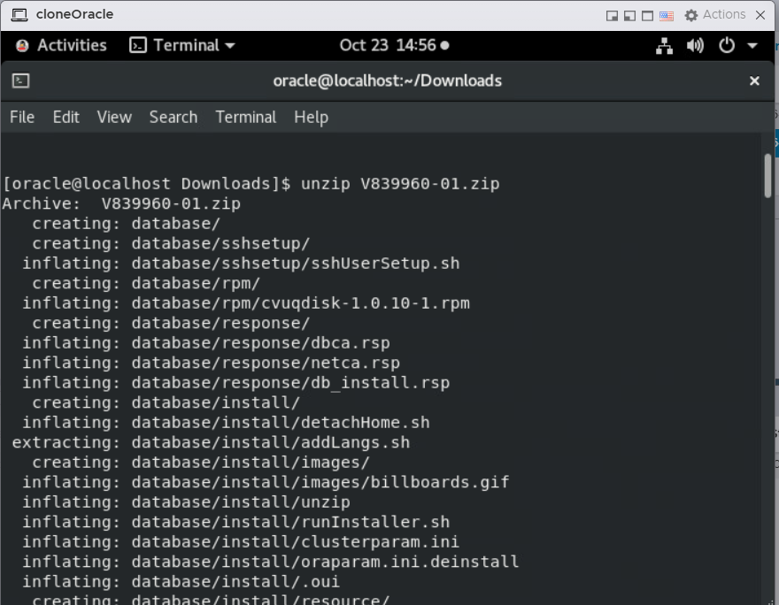

<br/><br/>

En la imagen siguiente, se muestran las variables de entorno configuradas para **Oracle Database 12c**, las cuales permiten que el sistema reconozca la instancia activa y su ubicación dentro del servidor. La instancia identificada es **`orcl2`**, ubicada en el directorio `/u01/app/oracle/product/12c/dbhome_2`.

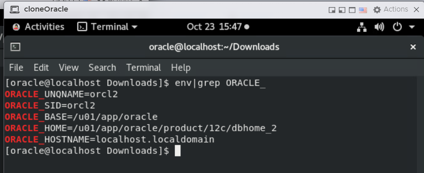

<br/><br/>


En las imágenes siguientes, se muestra la ejecución del comando `./runInstaller` desde el directorio database, el cual inicia el Oracle Universal Installer (OUI).
El instalador verifica los requisitos mínimos del sistema, como el espacio temporal, el espacio de intercambio (swap) y la configuración del monitor, confirmando que todos los parámetros han sido superados exitosamente antes de iniciar la instalación gráfica.


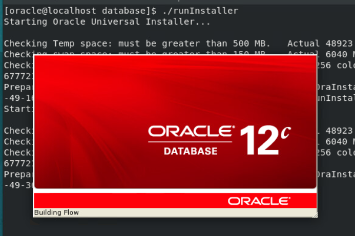

<br/>

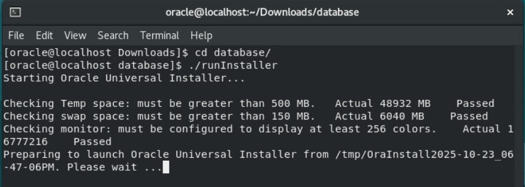

<br/><br/>

En la imagen siguiente, se muestra una advertencia del instalador de Oracle Database 12c Release 2, indicando que el sistema operativo actual no está certificado oficialmente para esta versión del software.
El mensaje explica que no se realizarán las verificaciones de prerrequisitos, aunque el usuario puede continuar la instalación bajo su responsabilidad seleccionando la opción **"Yes"**.

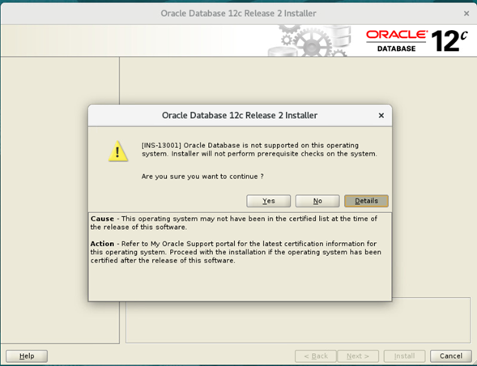

<br/><br/>

En esta imagen, el instalador solicita un correo electrónico vinculado a My Oracle Support para recibir notificaciones sobre parches y alertas, aunque es posible continuar sin registrar esta información desmarcando la opción y dando click en **"Next"**.

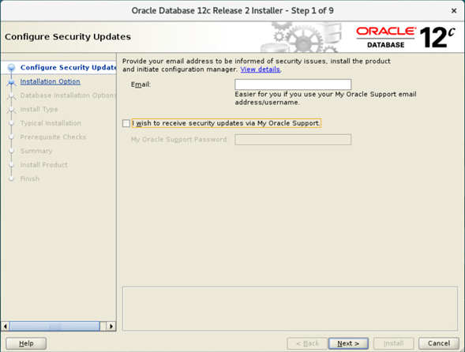

<br/><br/>

El instalador pregunta si el usuario desea continuar sin recibir notificaciones de My Oracle Support sobre posibles vulnerabilidades críticas; para seguir con la instalación, se debe dar click en **"Yes"**.

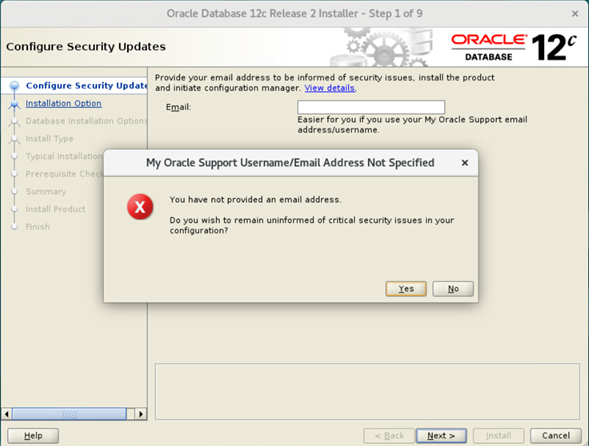

<br/><br/>

En la imagen siguiente, se muestra el segundo paso del **Oracle Database 12c Release 2 Installer**, correspondiente a la selección del tipo de instalación.

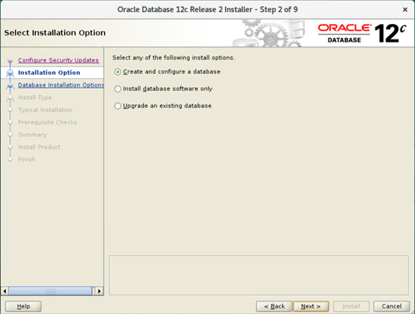

<br/><br/>

En la imagen siguiente, se muestra el paso 3 del **Oracle Database 12c Release 2 Installer**, donde se selecciona la **clase de sistema**.

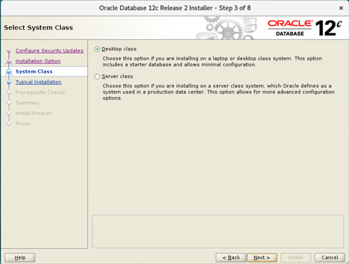

<br/><br/>

En la imagen siguiente, se muestra el paso 4 del **Oracle Database 12c Release 2 Installer**, correspondiente a la **configuración típica de instalación**.

Aquí se definen los parámetros básicos de la base de datos, incluyendo la ubicación del software, el tipo de edición, el conjunto de caracteres y el nombre de la base global (**orcl2**). Además, se habilita la opción **Create as Container database** con una base pluggable llamada **pdb2**, lo que permite trabajar con la arquitectura multitenant de Oracle 12c.

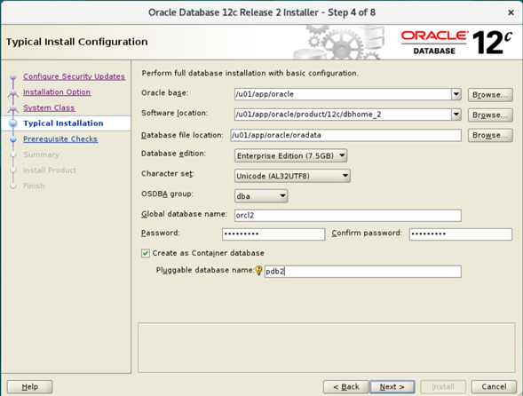

<br/><br/>


En la imagen siguiente, se muestra el paso 5 del **Oracle Database 12c Release 2 Installer**, donde se configura el **inventario de Oracle (oraInventory)**.

Se especifica la ruta **`/u01/app/oraInventory`** y se asigna el grupo del sistema **`oinstall`** con permisos de escritura para administrar futuras instalaciones o actualizaciones.

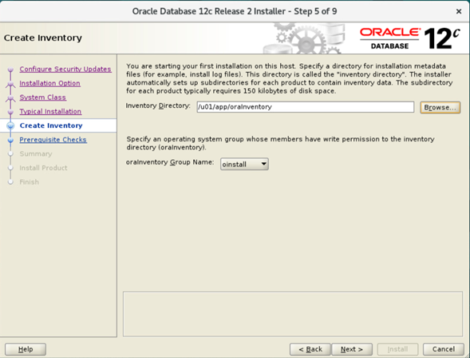

<br/><br/>

En la imagen siguiente, se muestra el paso 6 del **Oracle Database 12c Release 2 Installer**, correspondiente al **resumen de instalación**.

Aquí se visualizan todos los parámetros configurados antes de iniciar el proceso, incluyendo la ruta del software, el inventario, el tipo de base de datos (**orcl2** con una PDB llamada **pdb2**), el grupo de usuarios y el conjunto de caracteres (**AL32UTF8**). Este resumen permite verificar la configuración final antes de presionar **Install** para comenzar la instalación.

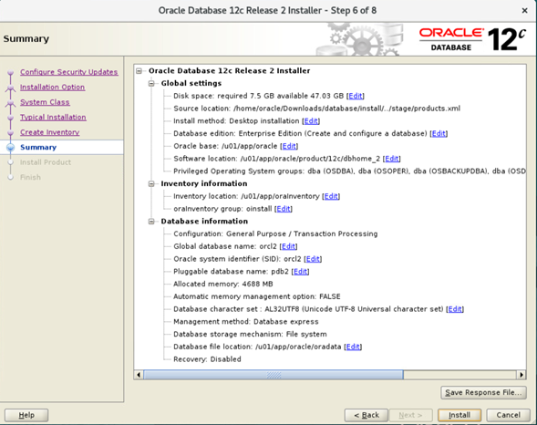

<br/><br/>

En la imagen siguiente, se muestra la opción de **guardar el archivo de respuesta** durante el proceso de instalación de **Oracle Database 12c**.
El archivo, con extensión **`.rsp`**, contiene todos los parámetros seleccionados en la instalación y permite **repetir la configuración de forma automática** en futuras instalaciones sin intervención del usuario. En este caso, se asigna el nombre **`db12.rsp`**.

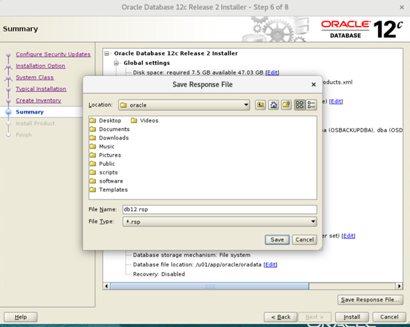

<br/><br/>

En la imagen siguiente, se muestra el paso 7 del **Oracle Database 12c Release 2 Installer**, donde se ejecuta la fase de instalación del producto.
El asistente indica que el proceso ha alcanzado un **79 % de avance** y además solicita ejecutar dos **scripts de configuración** como usuario `root`:

* `/u01/app/oraInventory/orainstRoot.sh`
* `/u01/app/oracle/product/12c/dbhome_2/root.sh`
  Estos scripts completan la configuración del entorno y ajustan permisos para el correcto funcionamiento de la base de datos.

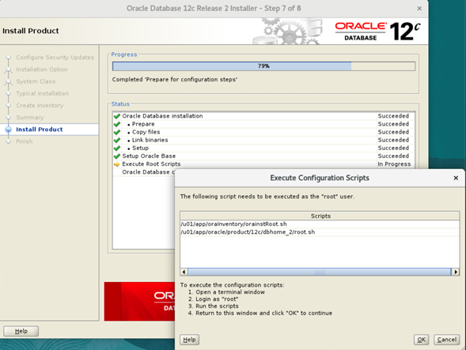

<br/>

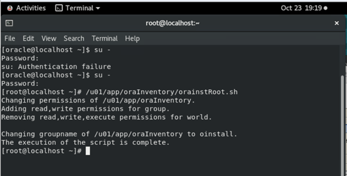

<br/>

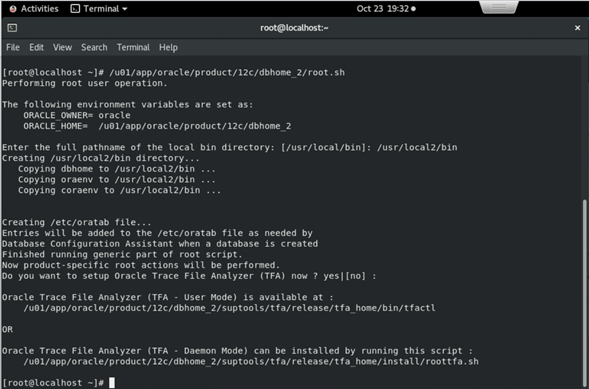

<br/>

En la imagen siguiente, se muestra el paso final del **Oracle Database 12c Release 2 Installer**, confirmando que la **instalación se completó exitosamente**.
El asistente proporciona la URL de acceso al **Oracle Enterprise Manager Database Express**, que permite administrar la base de datos desde un navegador web:
`https://localhost.localdomain:5500/em`

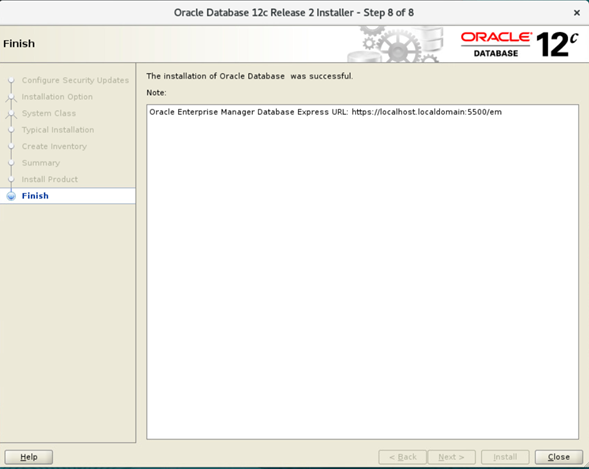

<br/><br/>

En la imagen siguiente, se confirma que la instancia activa es **`orcl2`** y, mediante el comando `SHOW PDBS`, se verifica la presencia de las bases pluggables **`PDB$SEED`** (modo *READ ONLY*) y **`PDB2`** (modo *READ WRITE*), lo que demuestra que la instalación y configuración del entorno multitenant se realizaron correctamente.

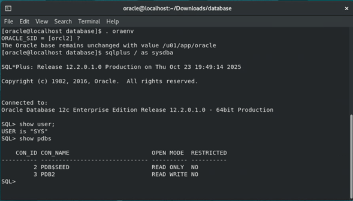

<br/><br/>

El usuario `SYS` inicia la instancia utilizando el script de entorno `setEnv2.sh` y, al ejecutar el comando `startup`, la base de datos se **monta y abre correctamente**, confirmando que el proceso de migración fue exitoso.

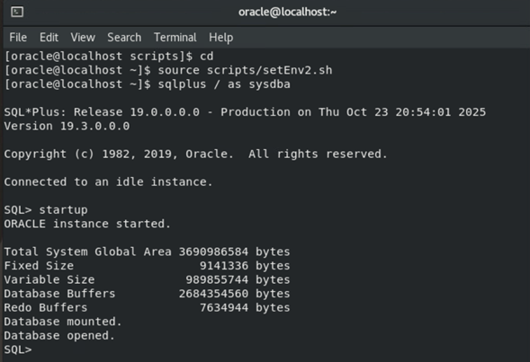

<br/><br/>

En la imagen siguiente, se muestra la verificación final posterior al Upgrade.
Mediante las consultas `SELECT name FROM v$database;` y `SELECT banner FROM v$version;`, se comprueba que la base de datos **mantiene el nombre `ORCL2`** y ahora ejecuta la versión **Oracle Database 19c Enterprise Edition Release 19.0.0.0.0 - Production**, confirmando la finalización exitosa del **Upgrade**.

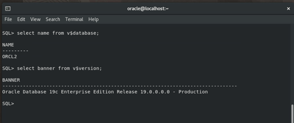

<br/><br/>


