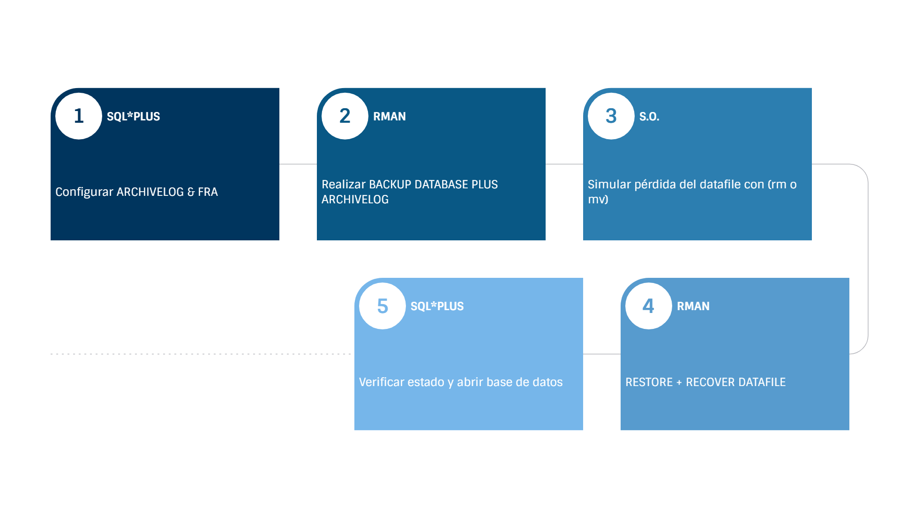

# Práctica 4.1. Restauración y recuperación con RMAN

<br/><br/>

## Objetivo 
Al finalizar esta práctica, serás capaz de
- Configurar y utilizar RMAN para realizar respaldos completos de la base de datos Oracle 19c y ejecutar procesos de restauración y recuperación ante la pérdida de archivos de datos, garantizando la integridad y continuidad operativa del sistema.

<br/><br/>

## Tiempo estimado
- 60 minutos.

<br/><br/>

## Objetivo visual 



<br/><br/>


## Tabla de ayuda

| Concepto / Comando                  | Descripción                                                                                         |
| ----------------------------------- | --------------------------------------------------------------------------------------------------- |
| **RMAN**                            | Recovery Manager: herramienta de respaldo y recuperación de Oracle.                                 |
| **ARCHIVELOG**                      | Modo que permite generar copias de los redo logs necesarios para la recuperación completa.          |
| **FRA**                             | Fast Recovery Area: espacio de disco reservado para respaldos, archived logs y flashback logs.      |
| **BACKUP DATABASE PLUS ARCHIVELOG** | Comando RMAN que realiza un respaldo completo de la base de datos junto con los archived redo logs. |
| **RESTORE DATAFILE**                | Recupera un archivo de datos perdido desde un respaldo previo.                                      |
| **RECOVER DATAFILE**                | Aplica los archived redo logs necesarios para dejar el datafile en estado consistente.              |
| **RESETLOGS**                       | Reabre la base de datos tras una recuperación, creando un nuevo conjunto de logs.     |
| **V$RECOVER_FILE**  | Vista dinámica que se utiliza para mostrar el estado de los archivos de datos (datafiles) que necesitan ser recuperados.  |

<br/><br/>


## Instrucciones

### Tarea 1. Configuración de RMAN y Full Backup


> **Nota**
>
> Si tu base de datos **ya se encuentra configurada en modo ARCHIVELOG** y el área de recuperación rápida (**FRA**) está definida correctamente, puedes **omitir los pasos de configuración 1 a 4** y comenzar directamente desde el paso 5, para **realizar el respaldo completo con RMAN**.

#### **Paso 1.** Entra en modo MOUNT.
   Inicia sesión en SQL*Plus con privilegios de administrador y ejecuta:

   ```bash
   sqlplus / as sysdba
   ```

   ```sql
   SHUTDOWN IMMEDIATE;
   STARTUP MOUNT;
   ```

        
> **Nota**
> 
> Este modo permite modificar configuraciones críticas de la base de datos, como el modo de archivado.
> Verifica que la base de datos se encuentre en **modo MOUNT** antes de continuar.
> Puedes comprobarlo ejecutando el siguiente comando:
>
> ```sql
> SELECT open_mode FROM v$database;
> ```
>
> El resultado debe mostrar **MOUNTED**, lo que indica que la base de datos está montada correctamente y lista para habilitar el modo ARCHIVELOG.


#### **Paso 2.** Habilita ARCHIVELOG.
Ejecuta el siguiente comando:

   ```
   ALTER DATABASE ARCHIVELOG;
   ```

   Este paso activa la creación de archivos *Archived Redo Logs*, lo cual es indispensable para una recuperación completa.

#### **Paso 3.** Abre la base de datos.
   Una vez activado el modo ARCHIVELOG, abre la base de datos con:

   ```
   ALTER DATABASE OPEN;
   ```

   Esto devuelve la base de datos a su estado operativo normal.

#### **Paso 4.** Configura el área de recuperación rápida (FRA).
   Si no tienes configurado el FRA, defínelo con los siguientes comandos.

   ```
   ALTER SYSTEM SET DB_RECOVERY_FILE_DEST='/u01/app/oracle/fast_recovery_area' SCOPE=BOTH;
   ALTER SYSTEM SET DB_RECOVERY_FILE_DEST_SIZE=14G SCOPE=BOTH;
   ```

   Este área se utilizará para almacenar respaldos, archived logs y flashback logs.

#### **Paso 5.** Realiza un respaldo completo con RMAN.
   Conéctate a RMAN y ejecuta:

   ```bash
   rman target /
   ```
   
   ```rman
   BACKUP DATABASE PLUS ARCHIVELOG;
   ```

   Esto crea una copia completa de la base de datos y de los archivos de redo logs archivados.

<br/><br/>


### Tarea 2. Pérdida de un Data File y recuperación

#### **Paso 1.** Identifica el archivo de datos a simular como perdido.
   Abre SQL*Plus y localiza el datafile del tablespace `USERS`:

   ```sql
    SELECT name FROM v$datafile WHERE tablespace_name = 'USERS';
   ```

   Anota la ruta completa del archivo (por ejemplo: `/u01/app/oracle/oradata/ORCL/users01.dbf`).

#### **Paso 2.** Simula el fallo físico del archivo.
   Desde SQL*Plus (usando el prefijo `!`) o directamente en el sistema operativo, elimina el archivo:

   ```sql
   sqlplus / as sysdba
   !rm /u01/app/oracle/oradata/ORCL/users01.dbf
   ```
   
```
   El paso anterior simula la pérdida de un datafile. 
   Si intentamos hacer un shutdown immediate, recibiremos varios errores.
```

```
   SQL>shutdown immediate
   ORA-01116: error in opening database file 7
   ORA-01110: data file 7: '/u01/app/oracle/oradata/ORCL/users01.dbf'
   ORA-27041: unable to open file

   Nos salimos de la sesión.
   SQL>exit
   ```

#### **Paso 3.** Conéctate a RMAN.
   Inicia una sesión en RMAN con:

   ```bash
   rman target /
   REPORT SCHEMA

   Si observas el datafile "users01.dbf" aun esta registrado pero con tamaño 0.
   ```

   Desde aquí podrás diagnosticar y ejecutar la restauración.

#### **Paso 4.** Restaura y recupera el datafile.
   Ejecuta los siguientes comandos, reemplazando la ruta por la ruta real del archivo identificada en el paso 1 (por ejemplo: /u01/app/oracle/oradata/ORCL/users01.dbf):

   ```
   shutdown abort
   startup mount

   RESTORE DATAFILE '/u01/app/oracle/oradata/ORCL/users01.dbf';
   RECOVER DATAFILE '/u01/app/oracle/oradata/ORCL/users01.dbf';
   exit
   ```

   RMAN restaurará el archivo perdido desde el respaldo más reciente y aplicará los Archived Redo Logs necesarios para dejarlo actualizado.

#### **Paso 5.** Verifica la recuperación y abrir la base de datos.
   Regresa a SQL*Plus y ejecuta:

   ```
   sqlplus / as sysdba
   SELECT status FROM v$instance;
   ALTER DATABASE OPEN;
   ```

   Lo anterior verifica el estado actual y finalmente abre la base de datos.

<br/><br/>

## Resultado esperado


Al finalizar esta práctica, deberás haber configurado correctamente el entorno de respaldo y recuperación en Oracle 19c, utilizando **RMAN** como herramienta principal.

En concreto, se espera que:

* La base de datos haya sido configurada en **modo ARCHIVELOG** y cuente con un área de recuperación rápida (**FRA**) definida.
* Se haya ejecutado con éxito un **respaldo completo de la base de datos** mediante el comando `BACKUP DATABASE PLUS ARCHIVELOG`.
* Tras la **simulación de pérdida de un archivo de datos**, hayas logrado **restaurar y recuperar** el datafile utilizando RMAN.
* La instrucción:

  ```sql
  SELECT status FROM v$recover_file;
  ```

  devuelva el valor **`no rows selected`**, indicando que no existen archivos pendientes de recuperación.
* Finalmente, la base de datos se abra correctamente con:

  ```sql
  ALTER DATABASE OPEN;
  ```

Confirmando que la restauración y recuperación se completaron de forma exitosa.

Como evidencia, el alumno debe poder **mostrar el log de RMAN** con la operación de respaldo y recuperación completada sin errores.

