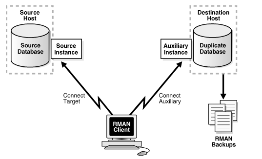

# Práctica 4.3. Duplicación de bases de datos con RMAN

## Objetivo

Al finalizar esta práctica, serás capaz de:
- Duplicar una base de datos existente (ORCL) para crear una copia funcional e independiente (TESTDB)** utilizando **RMAN y la técnica de duplicación activa**, sin necesidad de respaldos físicos previos.
- Consolidar los conocimientos de administración, copia y configuración de instancias, y es fundamental para escenarios de **pruebas, desarrollo o migraciones controladas**.

<br/><br/>

## Tiempo estimado
- 60 minutos

<br/><br/>

## Objetivo visual

<p align="center">
  
  <br/>
  <em>Figura 1. Proceso de duplicación de base de datos con RMAN</em>
  <em>Source: docs.oracle.com </em>
</p>


<br/><br/>

## Tabla de ayuda

| Concepto / Comando          | Descripción                                                                                                                     |
| --------------------------- | ------------------------------------------------------------------------------------------------------------------------------- |
| **RMAN** | Herramienta de Oracle para respaldo, recuperación y duplicación de bases de datos.                                              |
| **Duplicación activa**      | Técnica que permite clonar una base de datos directamente desde una instancia en ejecución, sin necesidad de respaldos previos. |
| **TARGET DATABASE**         | Base de datos fuente desde la cual se realiza la duplicación (en este caso, ORCL).                                              |
| **AUXILIARY DATABASE**      | Nueva base de datos que se crea a partir de la duplicación (en este caso, TESTDB).                                              |
| **PFILE**                   | Archivo de parámetros utilizado para iniciar la nueva instancia en modo NOMOUNT.                                                |
| **SPFILE**                  | Versión binaria del archivo de parámetros creada automáticamente por Oracle durante la duplicación.                             |
| **DB_FILE_NAME_CONVERT**    | Parámetro que indica a RMAN cómo ajustar las rutas de los datafiles desde la BD origen a la BD duplicada.                       |
| **NOFILENAMECHECK**         | Opción que evita validaciones de ruta duplicadas, útil en entornos de laboratorio.                                              |
| **RESETLOGS**               | Reinicia el contador de redo logs en la base de datos duplicada, creando una nueva *incarnation*.                               |


<br/><br/>

## Instrucciones

### Tarea 1. Duplicación activa (de ORCL a TESTDB)

Antes de comenzar, asegúrate de que:

* La base de datos **ORCL** (fuente) se encuentra **abierta** y accesible.
* Se ha creado el archivo **initTESTDB.ora** con las rutas de los datafiles apuntando al nuevo destino, por ejemplo:
  `/u01/app/oracle/oradata/TESTDB/`
* Las variables de entorno para la instancia TESTDB están correctamente configuradas:

  ```bash
  export ORACLE_SID=TESTDB
  ```

<br/><br/>

#### **Paso 1.** Arranca la instancia auxiliar TESTDB

Inicia sesión en SQL*Plus y levanta la instancia **en modo NOMOUNT** utilizando su propio archivo de parámetros:

```bash
STARTUP NOMOUNT PFILE='$ORACLE_HOME/dbs/initTESTDB.ora';
```

Este paso prepara la instancia TESTDB para recibir la duplicación desde la base de datos origen.

<br/><br/>

#### **Paso 2.** Conéctate a RMAN.

Desde la línea de comandos, conéctate a RMAN, estableciendo comunicación con la base de datos origen (**TARGET**) y la nueva base de datos (**AUXILIARY**):

```bash
rman target sys@ORCL auxiliary sys@TESTDB
```

RMAN validará las conexiones y sincronizará la información de control necesaria.

<br/><br/>

#### **Paso 3.** Ejecuta la duplicación activa.

Ejecuta el siguiente comando de duplicación en RMAN:

```rman
DUPLICATE TARGET DATABASE TO TESTDB 
FROM ACTIVE DATABASE 
SPFILE 
SET DB_FILE_NAME_CONVERT '/ORCL/', '/TESTDB/' 
NOFILENAMECHECK;
```

Este comando realiza las siguientes acciones:

* Copia directamente los datafiles desde la base de datos activa (ORCL).
* Crea un nuevo archivo de control y un SPFILE para TESTDB.
* Aplica los redo logs necesarios.
* Abre la base de datos duplicada con **RESETLOGS**, creando una nueva *incarnation*.

<br/><br/>

#### **Paso 4.** Verifica el estado de la nueva base de datos.

Conéctate a la base de datos duplicada y valida que esté operativa.

```sql
SELECT name, open_mode FROM v$database;
```

El resultado esperado debe mostrar algo similar a lo siguiente.

```
NAME      OPEN_MODE
--------- --------------------
TESTDB    READ WRITE
```

<br/> <br/>

## **Resultado esperado**

Al finalizar esta práctica:

* Habrás duplicado con éxito la base de datos **ORCL** creando una copia funcional llamada **TESTDB**.
* La base de datos **TESTDB** estará **abierta en modo READ WRITE**, completamente independiente y lista para uso de pruebas o desarrollo.
* RMAN habrá generado un **nuevo SPFILE** y archivos de control específicos para la instancia duplicada.
* Podrás validar el proceso mediante el log de RMAN, el cual debe indicar la creación exitosa del control file y la apertura de la base duplicada con:

  ```
  Database duplicated successfully
  ```


