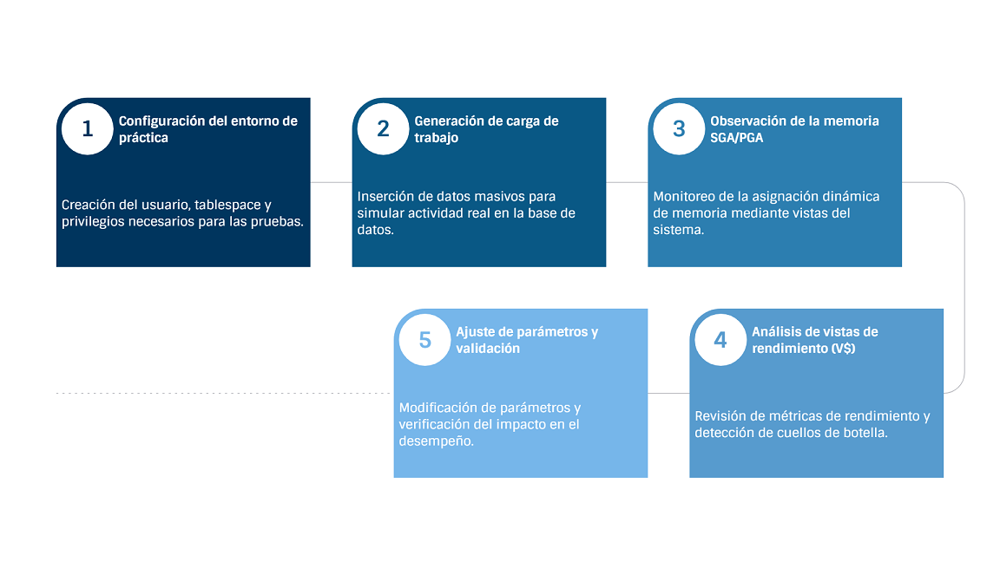

# Práctica 5.1 Monitoreo y ajuste de rendimiento

## Objetivo

Al finalizar esta práctica, serás capaz de:

* Identificar los cuellos de botella y las causas de un rendimiento deficiente.
* Ajustar los componentes clave de la instancia (memoria, almacenamiento) para optimizar el desempeño.
* Utilizar las herramientas de autodiagnóstico y ajuste de Oracle para simplificar las tareas del DBA.
* Mantener un rendimiento estable y predecible a lo largo del tiempo.

<br/><br/>

## Tiempo estimado

- 20 minutos.

<br/><br/>

## Tabla de ayuda

Las vistas y tablas utilizadas durante la práctica de *Monitoreo y Ajuste de Rendimiento*.


| Vista / Tabla                | Descripción breve                                                                                                                              | Referencia oficial                                                                                                                          |
| ---------------------------- | ---------------------------------------------------------------------------------------------------------------------------------------------- | ------------------------------------------------------------------------------------------------------------------------------------------- |
| **`V$PARAMETER`**              | Muestra los parámetros de inicialización actuales de la instancia, incluyendo valores de memoria (SGA, PGA, MEMORY_TARGET, etc.).              | [Oracle Docs – V$PARAMETER](https://docs.oracle.com/en/database/oracle/oracle-database/19/refrn/V-PARAMETER.html)                           |
| **`V$SGA_DYNAMIC_COMPONENTS`** | Contiene información sobre los componentes dinámicos de la SGA y sus tamaños actuales, útiles para observar la gestión de memoria automática.  | [Oracle Docs – V$SGA_DYNAMIC_COMPONENTS](https://docs.oracle.com/en/database/oracle/oracle-database/19/refrn/V-SGA_DYNAMIC_COMPONENTS.html) |
| **`V$DB_CACHE_ADVICE`**        | Proporciona recomendaciones del asesor de caché (Buffer Cache Advisor) para determinar el tamaño óptimo del buffer y estimar lecturas físicas. | [Oracle Docs – V$DB_CACHE_ADVICE](https://docs.oracle.com/en/database/oracle/oracle-database/19/refrn/V-DB_CACHE_ADVICE.html)               |
| **`DBMS_STATS`**               | Paquete PL/SQL utilizado para recolectar estadísticas de objetos del esquema, lo cual mejora las decisiones del optimizador de consultas.      | [Oracle Docs – DBMS_STATS](https://docs.oracle.com/en/database/oracle/oracle-database/19/arpls/DBMS_STATS.html)                             |
| **`DBMS_WORKLOAD_REPOSITORY`** | Paquete que administra el repositorio de carga de trabajo (AWR), permitiendo crear y consultar snapshots de rendimiento.                       | [Oracle Docs – DBMS_WORKLOAD_REPOSITORY](https://docs.oracle.com/en/database/oracle/oracle-database/19/arpls/DBMS_WORKLOAD_REPOSITORY.html) |
| **`DBMS_SQLTUNE`**             | Paquete para el ajuste y diagnóstico de SQL mediante el SQL Tuning Advisor.                                                                    | [Oracle Docs – DBMS_SQLTUNE](https://docs.oracle.com/en/database/oracle/oracle-database/19/arpls/DBMS_SQLTUNE.html)                         |
| **`DBA_USERS`**                | Muestra información de todos los usuarios de la base de datos, incluidos tablespaces predeterminados y estado de la cuenta.                    | [Oracle Docs – DBA_USERS](https://docs.oracle.com/en/database/oracle/oracle-database/19/refrn/DBA_USERS.html)                               |
| **`DBA_TS_QUOTAS`**            | Permite verificar las cuotas de espacio asignadas y utilizadas por cada usuario en los tablespaces.                                            | [Oracle Docs – DBA_TS_QUOTAS](https://docs.oracle.com/en/database/oracle/oracle-database/19/refrn/DBA_TS_QUOTAS.html)                       |<br/><br/>

<br/><br/>

## Objetivo visual

El siguiente diagrama ilustra las etapas del proceso de ajuste de rendimiento:



<br/><br/>

## Configuración del ambiente

Se requiere una base de datos Oracle 19c (CDB/PDB) con privilegios de administrador (`SYS` o un usuario con roles de diagnóstico y ajuste).

<br/><br/>

## Instrucciones

### Tarea 1. Creación de usuario y conexión

Ejecuta los siguientes comandos como usuario **SYS** o **SYSTEM**:

1. Crea el tablespace del laboratorio.

Crea un espacio de almacenamiento dedicado a las pruebas, evitando que los objetos del laboratorio se mezclen con los de otros esquemas:

```sql
CREATE TABLESPACE lab_perf 
DATAFILE 'lab_perf_01.dbf' SIZE 100M 
AUTOEXTEND ON NEXT 10M MAXSIZE UNLIMITED;
```

2. Crea el usuario del laboratorio.

Crea un usuario específico para las prácticas, asignándole el tablespace recién creado como predeterminado y cuota ilimitada sobre él:

```sql
CREATE USER lab_dba IDENTIFIED BY "Lab19c#" 
DEFAULT TABLESPACE lab_perf 
QUOTA UNLIMITED ON lab_perf;
```


3. Otorga privilegios y roles necesarios.

Concede al usuario los privilegios y roles requeridos para ejecutar tareas administrativas, de diagnóstico y ajuste de rendimiento:

```sql
GRANT CONNECT, RESOURCE, DBA TO lab_dba;
GRANT ADVISOR, SELECT ANY DICTIONARY TO lab_dba;
GRANT EXECUTE ON DBMS_WORKLOAD_REPOSITORY TO lab_dba;
GRANT EXECUTE ON DBMS_SQLTUNE TO lab_dba;
```

> **Nota:** a partir de este punto, todas las acciones se realizarán conectándose como `LAB_DBA`.<br/><br/>


### Tarea 2. Generación de datos de carga

1. Conéctate como `lab_dba` y ejecuta los siguientes scripts para simular una carga realista.

2. Crea la tabla `VENTAS_LAB`.

```sql
CREATE TABLE VENTAS_LAB (
    ID NUMBER PRIMARY KEY,
    CLIENTE_ID NUMBER,
    FECHA_VENTA DATE,
    MONTO NUMBER(10,2),
    DESCRIPCION VARCHAR2(100)
) TABLESPACE lab_perf;

```

3. Crea la tabla `CLIENTES_LAB`.
```sql
CREATE TABLE CLIENTES_LAB (
    CLIENTE_ID NUMBER PRIMARY KEY,
    NOMBRE VARCHAR2(100),
    REGION VARCHAR2(50)
) TABLESPACE lab_perf;
```

4. Inserta datos de prueba a la tabla `CLIENTES_LAB`.

```sql

BEGIN
    FOR i IN 1..100 LOOP
        INSERT INTO CLIENTES_LAB VALUES (i, 'Cliente ' || i, 'Region ' || MOD(i,5));
    END LOOP;
    COMMIT;
END;
/

```

5. Inserta 2 millones de registros en la tabla `VENTAS_LAB`.

```sql

BEGIN
    FOR i IN 1..2000000 LOOP
        INSERT INTO VENTAS_LAB VALUES (
            i,
            MOD(i,100) + 1,
            DATE '2023-01-01' + TRUNC(DBMS_RANDOM.VALUE(0,365)),
            TRUNC(DBMS_RANDOM.VALUE(10,5000),2),
            'Venta de Producto '|| MOD(i,50)
        );
        IF MOD(i,50000)=0 THEN COMMIT; END IF;
    END LOOP;
    COMMIT;
END;
/

```

6. Recolecta las estadísticas para el optimizador.

```sql

EXEC DBMS_STATS.GATHER_SCHEMA_STATS(ownname => 'LAB_DBA', options => 'GATHER AUTO', estimate_percent => DBMS_STATS.AUTO_SAMPLE_SIZE, cascade => TRUE);

```

> **Nota:** este bloque puede tardar algunos minutos en completarse según la potencia del servidor.

<br/><br/>


### Tarea 3. Gestión de memoria (AMM/ASMM)

> **Nota** Observa cómo Oracle distribuye dinámicamente los recursos de memoria entre SGA y PGA.

1. Verifica el modo de gestión de memoria.

```sql

SELECT NAME, VALUE FROM V$PARAMETER WHERE NAME IN ('memory_target','sga_target','pga_aggregate_target');

```

2. Verifica los componentes dinámicos de la SGA.

```sql

SELECT COMPONENT, CURRENT_SIZE, USER_SPECIFIED_SIZE, OPER_COUNT FROM V$SGA_DYNAMIC_COMPONENTS;

```

3. Consulta las recomendaciones del asesor de caché (DB Cache Advisor).

```sql

SELECT SIZE_FOR_ESTIMATE, SIZE_FACTOR, ESTD_PHYSICAL_READS 
FROM V$DB_CACHE_ADVICE 
ORDER BY SIZE_FACTOR;

```

<br/><br/>

### Tarea 4. Simulación de carga de memoria

Ejecuta múltiples veces la siguiente consulta para forzar lecturas de datos desde el disco y observa el comportamiento del **Buffer Cache**.

```sql

-- Sentencia con muchas leturas sobre una tabla grande

SELECT /* Carga_SGA */ T.REGION, V.MONTO, COUNT(*)
FROM CLIENTES_LAB T, VENTAS_LAB V
WHERE T.CLIENTE_ID = V.CLIENTE_ID
GROUP BY T.REGION, V.MONTO
ORDER BY 2 DESC;

```

> **Observación:** monitorea nuevamente la vista `V$SGA_DYNAMIC_COMPONENTS` para detectar cambios en la asignación de memoria.

<br/><br/>


## Resultado esperado

Al finalizar la práctica, deberás haber:

* Configurado un entorno de laboratorio aislado para pruebas de rendimiento.
* Generado una carga de trabajo controlada con datos simulados.
* Consultado vistas de diagnóstico (`V$SGA_DYNAMIC_COMPONENTS`, `V$DB_CACHE_ADVICE`, `V$PARAMETER`).
* Observado la redistribución dinámica de la memoria entre SGA y PGA durante la ejecución de cargas.
* Comprendido cómo las herramientas internas de Oracle permiten ajustar y estabilizar el rendimiento general del sistema.
