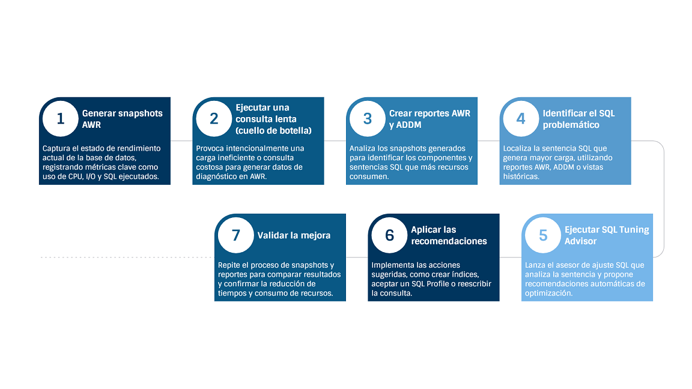
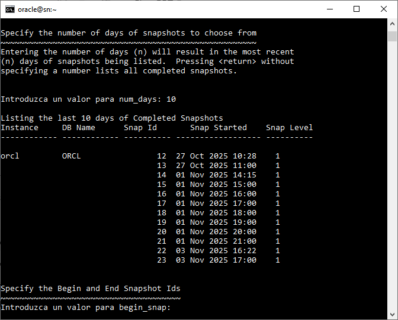

# Práctica 5.2.  Diagnóstico con AWR, ADDM y SQL Tuning Advisor

<br/><br/>

## Objetivo

Al finalizar esta práctica, serás capaz de generar y analizar reportes AWR y ADDM para identificar problemas de rendimiento en Oracle Database, así como utilizar SQL Tuning Advisor para obtener y aplicar recomendaciones de ajuste que optimicen el desempeño de consultas SQL.

<br/><br/>

## Tiempo estimado

- 20 minutos.

<br/><br/>

## Tabla 1. Scripts y paquetes de diagnóstico

| Nombre                       | Descripción                                                                                                                                                                                     |
| ---------------------------- | ----------------------------------------------------------------------------------------------------------------------------------------------------------------------------------------------- |
| `awrrpt.sql`               | Genera un reporte del *Automatic Workload Repository (AWR)* con métricas históricas del rendimiento de la base de datos, incluyendo consumo de CPU, I/O, memoria y sentencias SQL más costosas. |
| `addmrpt.sql`              | Produce un reporte del *Automatic Database Diagnostic Monitor (ADDM)* con hallazgos y recomendaciones de mejora basados en los snapshots AWR.                                                   |
| `awrsqrpt.sql`             | Crea un reporte detallado de rendimiento para un SQL específico, mostrando tiempos de ejecución, lecturas lógicas y físicas y plan de ejecución.                                               |
| `DBMS_WORKLOAD_REPOSITORY` | Paquete PL/SQL para crear, administrar y consultar snapshots AWR, así como ajustar parámetros de retención y frecuencia.                                                                        |
| `DBMS_SQLTUNE`             | Paquete PL/SQL que permite crear y ejecutar tareas de ajuste SQL y obtener recomendaciones automáticas del *SQL Tuning Advisor*.                                                                |<br/><br/>

<br/><br/>

## Tabla 2. Vistas de apoyo para diagnóstico de rendimiento

| Nombre de la vista    | Descripción                                                                                                                                              | Documentación oficial                                                                                                        |
| --------------------- | -------------------------------------------------------------------------------------------------------------------------------------------------------- | ---------------------------------------------------------------------------------------------------------------------------- |
| `DBA_HIST_SNAPSHOT` | Muestra información de cada snapshot de AWR, incluyendo su identificador (`SNAP_ID`), intervalo de tiempo, base de datos e instancia asociada.             | [Oracle 19c – DBA_HIST_SNAPSHOT](https://docs.oracle.com/en/database/oracle/oracle-database/19/refrn/DBA_HIST_SNAPSHOT.html) |
| `DBA_HIST_SQLTEXT`  | Contiene el texto completo de las sentencias SQL capturadas en los snapshots AWR, permitiendo identificar el `SQL_ID` y la instrucción exacta ejecutada. | [Oracle 19c – DBA_HIST_SQLTEXT](https://docs.oracle.com/en/database/oracle/oracle-database/19/refrn/DBA_HIST_SQLTEXT.html)   |
| `DBA_HIST_SQLSTAT` | Registra estadísticas históricas de ejecución de cada sentencia SQL, incluyendo lecturas lógicas, físicas, CPU y número de ejecuciones entre snapshots.  | [Oracle 19c – DBA_HIST_SQLSTAT](https://docs.oracle.com/en/database/oracle/oracle-database/19/refrn/DBA_HIST_SQLSTAT.html)   |


<br/><br/>

## Objetivo visual




<br/><br/>

## Instrucciones

### Tarea 1. Creación del cuello de botella

**Nota:** simular una carga ineficiente para observar su impacto en el rendimiento.

1. Completa la **Práctica 5.1.** y conéctate como usuario con privilegios adecuados.

2. Toma un *snapshot* AWR inicial:

   ```sql
   EXEC DBMS_WORKLOAD_REPOSITORY.CREATE_SNAPSHOT;
   ```

3. Ejecuta la siguiente consulta de 5 a 10 veces para simular el problema:

   ```sql
   SELECT /* CUELLO_BOTELLA_SQL */ SUM(monto)
   FROM ventas_lab
   WHERE cliente_id = 50;
   ```

   > **Nota:** el índice creado no se usará; Oracle forzará un *Full Table Scan*, simulando un escenario de bajo rendimiento.

4. Crea un *snapshot* AWR final:

   ```sql
   EXEC DBMS_WORKLOAD_REPOSITORY.CREATE_SNAPSHOT;
   ```

<br/><br/>

### Tarea 2. Generación de reportes AWR y ADDM

**Nota:** identificar las causas del rendimiento deficiente mediante análisis de snapshots.

1. Localiza los *snapshots* recién creados:

   ```sql
   SELECT SNAP_ID, BEGIN_INTERVAL_TIME, END_INTERVAL_TIME
   FROM DBA_HIST_SNAPSHOT
   ORDER BY SNAP_ID DESC;
   ```

   Anota el `START_SNAP_ID` y `END_SNAP_ID`.

2. Genera el reporte **AWR**:

   ```sql
   @?/rdbms/admin/awrrpt.sql
   ```

   Selecciona el formato **HTML** y proporciona los *snapshots* registrados.

3. Genera el reporte `ADDM`:

   ```sql
   @?/rdbms/admin/addmrpt.sql
   ```

4. Analiza la sección `FINDINGS` del reporte `ADDM`.
   Debería identificar la consulta `CUELLO_BOTELLA_SQL` como principal contribuyente al consumo de recursos, sugiriendo acciones de optimización.

<br/><br/>

## Resultado esperado

* El **AWR** registra correctamente los snapshots antes y después de la ejecución de la consulta, reflejando un aumento en el consumo de CPU, lecturas físicas y tiempo de respuesta durante el intervalo de carga.
* El **reporte ADDM** identifica la consulta `CUELLO_BOTELLA_SQL` como una de las principales causantes del alto uso de recursos, mostrando su impacto en el rendimiento general de la base de datos.
* Los reportes generados permiten al participante **interpretar los hallazgos**, reconociendo los síntomas típicos de un cuello de botella provocado por *Full Table Scans* o ineficiencia en la ejecución de SQL.

<br/><br/>




