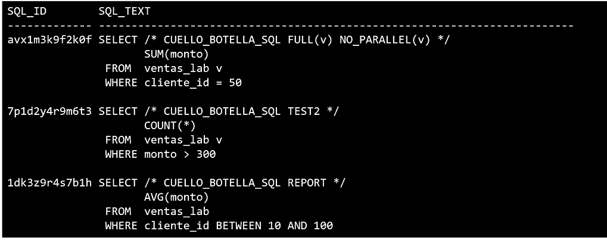

# Práctica 5.3 SQL Tuning Advisor

<br/><br/>

## Objetivo

Aplicar **SQL Tuning Advisor** para analizar una consulta que genera cuello de botella, interpretar su reporte e **implementar la recomendación de índice** (u otra acción sugerida) para mejorar el rendimiento de forma medible.

<br/><br/>

## Tiempo estimado

- 20 minutos.

<br/><br/>

## Tabla de ayuda 

| Nombre                               | Descripción funcional                                                                                                                                                  |
| ------------------------------------ | ---------------------------------------------------------------------------------------------------------------------------------------------------------------------- |
| `SQL_TEXT`                         | Contiene el texto completo de la sentencia SQL ejecutada. Se utiliza para identificar consultas específicas y asociarlas con su `SQL_ID` para análisis de rendimiento. |
| `DBA_HIST_SQLTEXT`                 | Vista que almacena el texto de las sentencias SQL capturadas en los snapshots AWR, permitiendo analizar consultas históricas aunque ya no estén en caché.              |
| `DBMS_SQLTUNE`                     | Paquete PL/SQL que agrupa los procedimientos utilizados por el *SQL Tuning Advisor* para analizar y optimizar sentencias SQL de alto costo.                            |
| `DBMS_SQLTUNE.DROP_TUNING_TASK`    | Elimina una tarea de ajuste SQL existente, permitiendo reiniciar o limpiar análisis previos.                                                                           |
| `DBMS_SQLTUNE.CREATE_TUNING_TASK`  | Crea una nueva tarea de ajuste para un `SQL_ID` o texto SQL, definiendo el alcance, tiempo y nombre del análisis.                                                      |
| `DBMS_SQLTUNE.EXECUTE_TUNING_TASK` | Ejecuta la tarea de tuning creada, haciendo que Oracle analice la sentencia y recopile posibles mejoras de rendimiento.                                                |
| `DBMS_SQLTUNE.REPORT_TUNING_TASK`  | Genera un reporte con las recomendaciones del análisis, como creación de índices, aceptación de *SQL Profiles* o reescritura de la consulta.                           |<br/><br/>

<br/><br/>

## Instrucciones

### Tarea 1. Preparación

1. Haber concluido Práctica 5.1. y 5.2.

<br/><br/>

### Tarea 2. Identificar la sentencia problemática

1. Localiza el `SQL_ID` por firma o marca de comentario usada en el lab previo:

   ```sql
   SELECT sql_id,  sql_text FROM v$sql WHERE sql_text LIKE '%CUELLO_BOTELLA_SQL%';

   -- Localiza el SQL_ID (por ejemplo '8z3x9v2k0a000')
   ```

2. Anota `&sql_id_problema`.

<br/><br/>

### Tarea 3. Crear y ejecutar la tarea de ajuste (STA)

1. Crea la tarea apuntando al `SQL_ID`:

   ```sql
   DECLARE
     v_task_name VARCHAR2(30) := 'STA_VENTAS_LAB';
   BEGIN
     DBMS_SQLTUNE.DROP_TUNING_TASK(v_task_name); -- ignora error si no existe
   EXCEPTION WHEN OTHERS THEN NULL; END;
   /
   DECLARE
     v_task_name VARCHAR2(30) := 'STA_VENTAS_LAB';
   BEGIN
     v_task_name := DBMS_SQLTUNE.CREATE_TUNING_TASK(
       sql_id     => '&sql_id_problema', -- AQUI, reemplaza con tu SQL_ID
       time_limit => 100,
       scope      => DBMS_SQLTUNE.SCOPE_COMPREHENSIVE,
       task_name  => 'STA_VENTAS_LAB',
       description=> 'Tuning VENTAS_LAB'
     );
     DBMS_SQLTUNE.EXECUTE_TUNING_TASK(task_name => 'STA_VENTAS_LAB');
   END;
   /
   ```

<br/><br/>


### Tarea 4. Revisar el reporte del STA y extraer acciones

1. Genera el reporte y **lee cuidadosamente las recomendaciones**:

   ```sql
   SET LONG 100000 
   SET PAGESIZE 1000
   SELECT DBMS_SQLTUNE.REPORT_TUNING_TASK('STA_VENTAS_LAB') AS report FROM dual;
   ```
2. Identifica si sugiere **crear índice**, **aceptar SQL Profile**, **actualizar estadísticas** o **reescritura**.

   *Nota:* para este lab, nos centraremos en la **creación del índice sugerido**.<br/><br/>


### Tarea 5. Implementar la recomendación de índice

1. Crea el índice propuesto (ajusta nombre, columnas y tablespace según el reporte):

   ```sql
   CREATE INDEX ventas_lab_cliente_idx 
   ON ventas_lab (cliente_id)
   TABLESPACE lab_perf;
   ```

   *Nota:* si el reporte sugiere índice compuesto (ej. `(cliente_id, fecha_venta)`), respeta el orden de columnas.


2. Verifica que el índice se creó:

   ```sql
   SELECT index_name, status, tablespace_name
   FROM   user_indexes
   WHERE  table_name = 'VENTAS_LAB';
   ```


<br/><br/>

### Tarea 6. Validar la mejora (tiempo y plan de ejecución)

1. Limpia la caché de sesión (sin afectar a otros):

   ```sql
   ALTER SESSION SET statistics_level = ALL;
   ```

2. Ejecuta la consulta original y mide:

   ```sql
   SELECT /* CUELLO_BOTELLA_SQL_FINAL */ SUM(MONTO)
   FROM   VENTAS_LAB
   WHERE  CLIENTE_ID = 50;
   ```

3. Muestra el plan real y estadísticas:

   ```sql
   -- Si la consulta sigue en caché, muestra el cursor:
   SELECT * FROM table(DBMS_XPLAN.DISPLAY_CURSOR(NULL, NULL, 'ALLSTATS LAST'));
   ```

   *Esperado:* cambio de `FULL TABLE SCAN` a `INDEX RANGE SCAN` (u operación con índice).

4. Opcional: compara tiempos antes y después con `SET TIMING ON` o usando `elapsed_time`/`buffer_gets` en `V$SQL` para ese `SQL_ID`.

<br/><br/>

### Tarea 7. (Opcional) Aceptar SQL Profile, si se recomienda

1. Si el reporte sugiere **SQL Profile**, puedes aceptarlo:

   ```sql
   DECLARE
     v_name VARCHAR2(30);
   BEGIN
     v_name := DBMS_SQLTUNE.ACCEPT_SQL_PROFILE(
       task_name      => 'STA_VENTAS_LAB',
       name           => 'PROF_VENTAS_LAB',
       force_match    => TRUE
     );
   END;
   /
   ```

  **Usa perfiles con criterio; documenta el cambio y valida el impacto.**<br/><br/>

### Tarea 8. Documentación y limpieza

1. Guarda el reporte del STA (spool) en tu carpeta de evidencias:

   ```sql
   SPOOL sta_ventas_lab_report.txt
   SELECT DBMS_SQLTUNE.REPORT_TUNING_TASK('STA_VENTAS_LAB') FROM dual;
   SPOOL OFF
   ```

2. Elimina la tarea y, si es un entorno de práctica, **deja el índice** o elimínalo según indique el instructor:

   ```sql
   BEGIN
     DBMS_SQLTUNE.DROP_TUNING_TASK('STA_VENTAS_LAB');
   END;
   /
   -- Para limpiar el índice (opcional):
   -- DROP INDEX ventas_lab_cliente_idx;
   ```
   
<br/><br/>

## Resultado esperado

* Localizaste el `SQL_ID` de la sentencia problemática y creaste una **tarea STA** exitosa.
* Interpretaste el **reporte** identificando una recomendación de **índice** (o alternativa).
* **Implementaste** el índice sugerido respetando columnas y orden.
* La consulta mostró un **plan más eficiente** (por ejemplo, `INDEX RANGE SCAN` en lugar de `FULL TABLE SCAN`) y **reducción evidente** de tiempo / lecturas lógicas.
* Dejaste evidencia: reporte STA, plan **antes/después**, tiempos y decisiones (incluida limpieza o permanencia del cambio).

<br/><br/>

La salida del query *SELECT sql_id, sql_text FROM v$sql WHERE sql_text LIKE '%CUELLO_BOTELLA_SQL%';* actúa como prueba de ejecución de las consultas lentas.
Verlas en **V$SQL** significa que el motor las parseó, ejecutó y registró su plan de ejecución y estadísticas, lo cual permite continuar con el análisis en AWR y ADDM para diagnosticar el problema de rendimiento.



<br/><br/>

